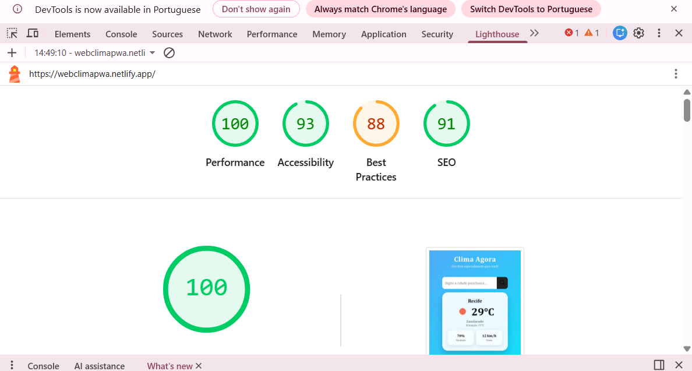

# 🌤️ Clima Agora - PWA

Aplicação web responsiva de previsão do tempo desenvolvida com **HTML, CSS e JavaScript**, consumindo API pública e evoluída para **PWA (Progressive Web App)** com uso de recursos de hardware.

## Sobre o projeto

O **Clima Agora** permite ao usuário consultar o clima de qualquer cidade ou utilizar sua **localização atual automaticamente**.

Esta versão representa uma evolução do projeto inicial, com melhorias significativas em:

*  Interface (UI/UX)
*  Performance
*  Funcionalidades (PWA + Hardware)
*  Métricas do Lighthouse

## Funcionalidades

*  Busca por nome da cidade
*  Geolocalização automática
*  Temperatura em tempo real
*  Velocidade do vento
*  Detecção de conexão (online/offline)
*  Instalação como aplicativo (PWA)
*  Layout responsivo (mobile-first)

## Tecnologias utilizadas

* HTML5
* CSS3
* JavaScript
* API Open-Meteo

##  Comparação de desempenho (Lighthouse)

### 🆕 Versão Melhorada

* ⚡ Performance: 100
* ♿ Acessibilidade: 93
* 🛠️ Boas práticas: 88
* 🔎 SEO: 91

### 🧪 Versão Inicial

* ⚡ Performance: 99
* ♿ Acessibilidade: 86
* 🛠️ Boas práticas: 73
* 🔎 SEO: 91

## Evoluções implementadas

*  Melhoria no design (UI mais moderna e mobile-first)
*  Implementação como **PWA (manifest + service worker)**
*  Uso de **geolocalização** para clima automático
*  Detecção de status da internet
*  Otimizações que melhoraram o score do Lighthouse

## Deploy

 Acesse o projeto:
 https://webclimapwa.netlify.app/

## 📲 PWA

O projeto pode ser instalado como aplicativo diretamente pelo navegador:

* ✔️ Funciona offline (parcialmente)
* ✔️ Pode ser adicionado à tela inicial
* ✔️ Experiência semelhante a app nativo

## Autora

Desenvolvido por **Abigail Maria Nazário** 
Estudante de Análise e Desenvolvimento de Sistemas

## Observações

Este projeto foi desenvolvido para fins educacionais, com foco em:

* Consumo de API
* Responsividade
* Progressive Web App (PWA)
* Uso de recursos de hardware do navegador

---

